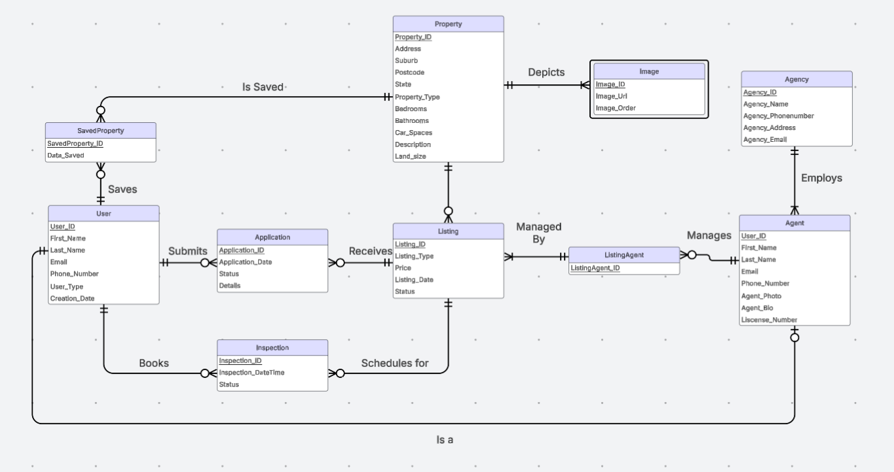

# Relational Database Design for a Real Estate Platform

This project demonstrates the end-to-end process of designing and implementing a relational database for a web platform inspired by RealEstate.com.au. The goal was to translate a set of complex business requirements into a structured, normalised, and functional PostgreSQL database.

This project was completed as a major assignment for the **31271 Database Fundamentals** course.

### Project Stages & Deliverables:

**1. Requirement Analysis & Business Rules:**
The initial phase involved analysing the core functions of a real estate platform to define entities, attributes, and relationships. This included modeling user accounts, property listings, agencies, agents, inspections, and applications. The detailed business rules and assumptions are reflected in the final ERD.

**2. Conceptual Data Modeling (ERD):**
An Entity-Relationship Diagram (ERD) was designed to visually represent the logical structure of the database. It establishes primary keys, foreign keys, cardinalities, and relationships between all entities, including supertype/subtype relationships (e.g., User/Agent).

 

**3. Logical Design & SQL Implementation:**
The conceptual model was translated into a physical database schema using PostgreSQL. The final SQL script (`Database-Schema.sql`) includes:
*   **Data Definition Language (DDL):** `CREATE TABLE` statements with appropriate data types, primary keys, foreign keys, and constraints.
*   **Data Manipulation Language (DML):** `INSERT` statements to populate the database with sample data for testing.
*   **Data Query Language (DQL):** A series of `SELECT` statements designed to test the database, demonstrating the use of `INNER JOIN`s, `GROUP BY` clauses, and subqueries to retrieve meaningful information.

### Key Skills Demonstrated:

*   **Database Design:** Translating business requirements into a robust relational model.
*   **Data Modeling:** Creating clear and accurate Entity-Relationship Diagrams (ERDs).
*   **SQL (PostgreSQL):**
    *   Writing DDL to create and define a database schema.
    *   Writing DML to populate and manipulate data.
    *   Constructing complex queries using `JOIN`s and subqueries for data retrieval.
*   **Data Normalisaion:** Designing a schema that reduces redundancy and improves data integrity.

---
*Disclaimer: The case study for this project was provided as part of the 31271 course curriculum. The database design, ERD, and SQL implementation are the original work of the authors.*
